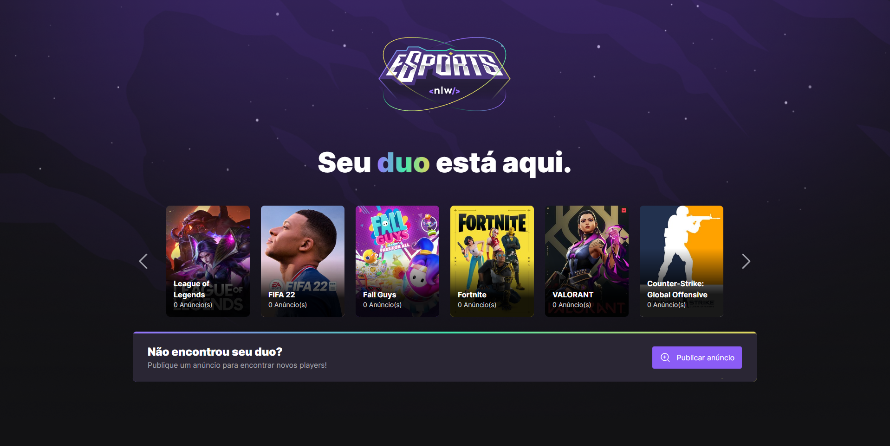
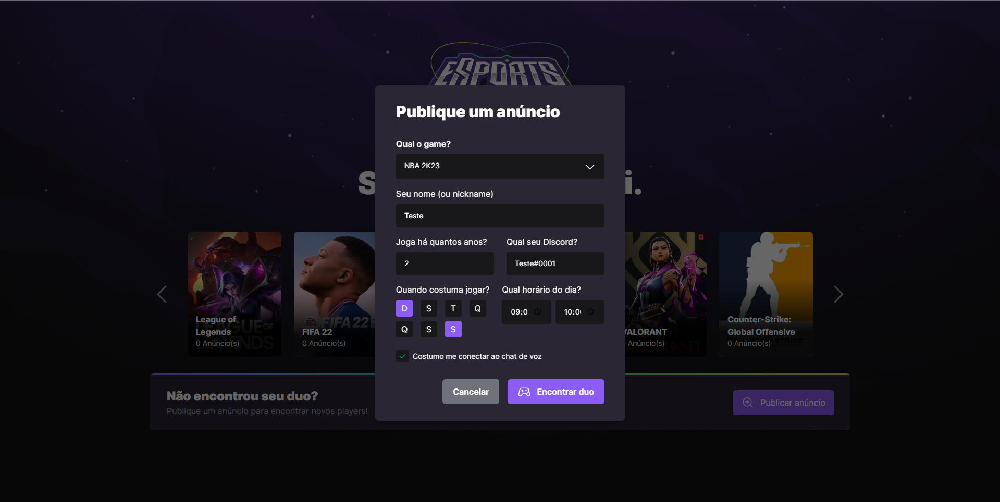
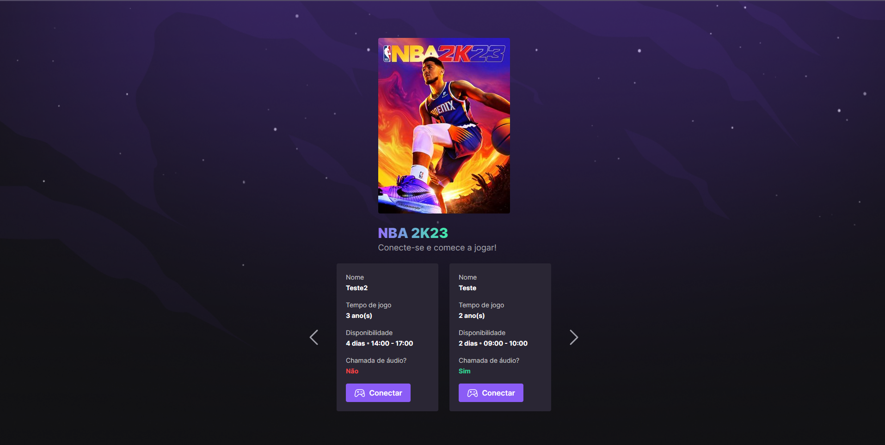

# NLW-eSports

## Aplicação para encontrar novas amizades em jogos online

## 🎨 Layout

<p align="center" style="display: flex; align-items: flex-start; justify-content: center;">
  
  
  
</p>

### 🛠 Tecnologias

As seguintes ferramentas foram usadas na construção do projeto:

- [Node.js](https://nodejs.org/en/)
- [Prisma](https://www.prisma.io/)
- [React (Vite)](https://vitejs.dev/)
- [TypeScript](https://www.typescriptlang.org/)
- [Axios](https://axios-http.com/ptbr/)
- [React Router Dom](https://v5.reactrouter.com/web/guides/quick-start)
- [Tailwindcss](https://tailwindcss.com/)
- [Radix](https://www.radix-ui.com/)

### Pré-requisitos

Antes de começar, você vai precisar ter instalado em sua máquina as seguintes ferramentas:
[Git](https://git-scm.com), [Node.js](https://nodejs.org/en/).
Além disto é bom ter um editor para trabalhar com o código como [VSCode](https://code.visualstudio.com/)

### 🐱‍🚀 Rodando o projeto

```bash
# Clone este repositório
$ git clone <https://github.com/kelvinpires/nlw-esports>

Rodando o Back End:

# Acesse a pasta do projeto no terminal/cmd
$ cd nlw-esports

# Vá para a pasta server
$ cd server

# Instale as dependências
$ npm install

# Execute a aplicação em modo de desenvolvimento
$ npm run dev

Rodando o Front End:

# Acesse a pasta do projeto no terminal/cmd
$ cd nlw-esports

# Vá para a pasta web
$ cd web

# Instale as dependências
$ npm install

# Execute a aplicação em modo de desenvolvimento
$ npm run dev

```
